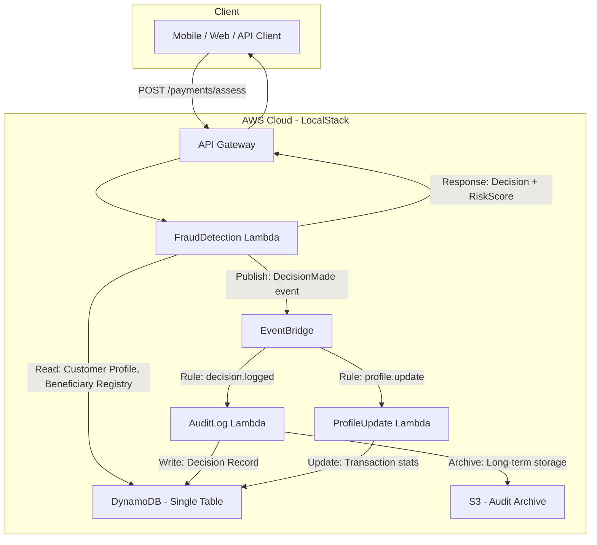

# Design Document: Payment Fraud Detection

## Overview

This design describes a real-time payment fraud detection system for intercepting Authorised Push Payment (APP) scams in UK Faster Payments. The system is implemented as a Java microservice deployed on AWS Lambda, exposed via Amazon API Gateway, and backed by DynamoDB for state management. It computes a composite risk score from four factors (amount, Confirmation of Payee, behavioural, and channel) and returns a fraud decision (ALLOW, REVIEW, or BLOCK) within a 300ms SLA.

The system follows an event-driven architecture using Amazon EventBridge for asynchronous operations (audit logging, profile updates) while keeping the synchronous decision path lean to meet latency requirements. All infrastructure runs on LocalStack for local development and testing.

### Key Design Decisions

1. **Single Lambda for scoring path** — A single Lambda function handles validation, scoring, and decision to avoid inter-Lambda network hops that would consume SLA budget.
2. **DynamoDB single-table design** — Customer profiles, beneficiary registry, and transaction history share a single table with composite keys to enable single-digit-millisecond reads.
3. **Circuit breaker pattern for SLA** — A 280ms timeout triggers a REVIEW fallback, reserving 20ms for response serialization.
4. **Asynchronous audit logging** — Decision records are written asynchronously via EventBridge to avoid blocking the response path.
5. **Pre-computed behavioural statistics** — Customer mean/stddev are pre-computed on each transaction and stored in the profile, avoiding real-time aggregation.

## Architecture



### Synchronous Path (< 300ms)

1. API Gateway receives `POST /payments/assess` with `FasterPaymentRequest` payload
2. FraudDetection Lambda validates the request
3. Lambda reads customer profile and beneficiary status from DynamoDB (BatchGetItem)
4. Risk scoring engine computes composite score
5. Decision engine maps score to ALLOW/REVIEW/BLOCK
6. Lambda publishes `DecisionMade` event to EventBridge (fire-and-forget)
7. Lambda returns decision response to API Gateway

### Asynchronous Path

1. EventBridge routes `DecisionMade` events to AuditLog Lambda
2. AuditLog Lambda persists the full decision record to DynamoDB and archives to S3
3. EventBridge routes `TransactionCompleted` events to ProfileUpdate Lambda
4. ProfileUpdate Lambda recalculates behavioural statistics (mean, stddev, device list)

## Components and Interfaces

### 1. FraudDetectionHandler (Lambda Entry Point)

```java
public class FraudDetectionHandler implements RequestHandler<APIGatewayProxyRequestEvent, APIGatewayProxyResponseEvent> {
    
    private final RequestValidator requestValidator;
    private final RiskScoringEngine riskScoringEngine;
    private final DecisionEngine decisionEngine;
    private final EventPublisher eventPublisher;
    private final CustomerProfileRepository customerProfileRepository;
    private final BeneficiaryRegistryRepository beneficiaryRegistryRepository;

    public APIGatewayProxyResponseEvent handleRequest(
        APIGatewayProxyRequestEvent event, Context context);
}
```

**Responsibility:** Orchestrates the synchronous fraud scoring path. Deserializes the request, invokes validation, retrieves required data, delegates scoring, publishes the decision event, and serializes the response.

### 2. RequestValidator

```java
public class RequestValidator {
    
    public ValidationResult validate(FasterPaymentRequest request);
}

public record ValidationResult(
    boolean valid,
    List<ValidationError> errors
) {}

public record ValidationError(
    String field,
    String message
) {}
```

**Responsibility:** Validates all fields of `FasterPaymentRequest` per Requirement 7. Returns all validation errors in a single pass.

### 3. RiskScoringEngine

```java
public class RiskScoringEngine {

    private final AmountScorer amountScorer;
    private final CopScorer copScorer;
    private final BehaviouralScorer behaviouralScorer;
    private final ChannelScorer channelScorer;

    public RiskAssessment score(
        FasterPaymentRequest request,
        CustomerProfile profile,
        BeneficiaryStatus beneficiaryStatus);
}

public record RiskAssessment(
    int riskScore,
    int amountScore,
    int copScore,
    int behaviouralScore,
    int channelScore,
    List<RiskFactor> riskFactors
) {}
```

**Responsibility:** Computes the composite risk score by summing four component scores. Each scorer is an independent, stateless function that receives the request and customer profile context.

### 4. Component Scorers

```java
public interface ComponentScorer {
    ScorerResult score(FasterPaymentRequest request, CustomerProfile profile);
}

public record ScorerResult(
    int score,           // 0-25
    String explanation   // max 200 chars
) {}
```

Implementations:
- **AmountScorer** — Evaluates transaction amount against customer's historical mean ± stddev. Applies dynamic threshold logic (Requirement 3).
- **CopScorer** — Maps CoP result to score range (Requirement 8).
- **BehaviouralScorer** — Evaluates session duration against historical averages (Requirement 9.4).
- **ChannelScorer** — Evaluates device, geolocation, and channel type risk (Requirement 9.1–9.3).

### 5. DecisionEngine

```java
public class DecisionEngine {

    public FraudDecision decide(
        RiskAssessment assessment,
        BeneficiaryStatus beneficiaryStatus,
        CustomerProfile profile,
        FasterPaymentRequest request);
}

public record FraudDecision(
    Decision decision,        // ALLOW, REVIEW, BLOCK
    int riskScore,
    List<RiskFactor> topRiskFactors,  // up to 3
    boolean thresholdOverride
) {}

public enum Decision { ALLOW, REVIEW, BLOCK }
```

**Responsibility:** Maps the composite risk score to a decision, applying overrides for beneficiary flags (Requirement 4) and dynamic threshold breaches (Requirement 3.2).

### 6. CustomerProfileRepository

```java
public interface CustomerProfileRepository {
    Optional<CustomerProfile> getProfile(String sortCode, String accountNumber);
    void updateProfile(CustomerProfile profile);
}
```

### 7. BeneficiaryRegistryRepository

```java
public interface BeneficiaryRegistryRepository {
    BeneficiaryStatus getStatus(String sortCode, String accountNumber);
}

public enum BeneficiaryFlag { NONE, HIGH_RISK, MULE_LINKED }

public record BeneficiaryStatus(
    BeneficiaryFlag flag,
    Instant lastUpdated
) {}
```

### 8. EventPublisher

```java
public interface EventPublisher {
    void publishDecisionMade(DecisionEvent event);
}
```

**Responsibility:** Publishes decision events to EventBridge asynchronously. Uses fire-and-forget semantics to avoid blocking the response path.

### 9. StepUpAuthenticator (Downstream Consumer)

```java
public record StepUpAction(
    StepUpType type,          // WARNING, SCA_CHALLENGE
    String scamTypology,
    List<String> riskFactors, // up to 3
    int maxAttempts,          // 3 for SCA
    Duration timeout          // 5 minutes for SCA
) {}

public enum StepUpType { WARNING, SCA_CHALLENGE }
```

**Responsibility:** Consumed by the downstream payment orchestrator. Not implemented in this Lambda but defined here for interface contract.

## Data Models

### DynamoDB Single-Table Design

| Entity | PK | SK | Attributes |
|--------|----|----|------------|
| CustomerProfile | `CUST#{sortCode}#{accountNumber}` | `PROFILE` | meanAmount, stdDevAmount, transactionCount90d, devices[], locations[], avgSessionDuration, lastUpdated |
| TransactionHistory | `CUST#{sortCode}#{accountNumber}` | `TXN#{timestamp}#{messageId}` | amount, creditorSortCode, creditorAccountNumber, channel, decision |
| BeneficiaryRegistry | `BENE#{sortCode}#{accountNumber}` | `STATUS` | flag (NONE/HIGH_RISK/MULE_LINKED), lastUpdated, reason |
| PaidBeneficiary | `CUST#{sortCode}#{accountNumber}` | `PAID#{creditorSortCode}#{creditorAccountNumber}` | firstPaidAt, lastPaidAt, transactionCount |
| DecisionAudit | `AUDIT#{messageId}` | `DECISION` | timestamp, debtorAccount, creditorAccount, amount, riskScore, decision, amountScore, copScore, behaviouralScore, channelScore, riskFactors[], explanations[] |
| DecisionByDebtor | `CUST#{sortCode}#{accountNumber}` | `AUDIT#{timestamp}#{messageId}` | (GSI projection for querying by debtor) |

### GSI: DecisionByDate

| GSI PK | GSI SK | Purpose |
|--------|--------|---------|
| `DECISION#{decision}` | `{timestamp}` | Query decisions by type and date range |

### FasterPaymentRequest Schema

```java
public record FasterPaymentRequest(
    String messageId,
    BankAccount debtorAccount,
    BankAccount creditorAccount,
    BigDecimal amount,
    String currency,
    String paymentReference,
    ConfirmationOfPayee confirmationOfPayee,
    Channel channel,
    Instant timestamp
) {}

public record BankAccount(
    String sortCode,
    String accountNumber,
    String accountName
) {}

public record ConfirmationOfPayee(
    CopResult result,
    String matchedName
) {}

public enum CopResult { MATCH, CLOSE_MATCH, NO_MATCH, NOT_AVAILABLE }

public record Channel(
    ChannelType type,
    String deviceId,
    GeoLocation geoLocation,
    Duration sessionDuration
) {}

public enum ChannelType { MOBILE, ONLINE_BANKING, API, BRANCH, PHONE }

public record GeoLocation(
    double latitude,
    double longitude
) {}
```

### Risk Assessment Response Schema

```java
public record FraudDecisionResponse(
    String messageId,
    Decision decision,
    int riskScore,
    RiskBreakdown breakdown,
    List<RiskFactor> riskFactors,
    Instant timestamp
) {}

public record RiskBreakdown(
    int amountScore,
    int copScore,
    int behaviouralScore,
    int channelScore
) {}

public record RiskFactor(
    String category,
    String explanation  // max 200 chars
) {}
```

### CustomerProfile

```java
public record CustomerProfile(
    String sortCode,
    String accountNumber,
    double meanAmount,
    double stdDevAmount,
    int transactionCount90d,
    List<String> knownDevices,
    List<GeoLocation> knownLocations,
    double avgSessionDurationMs,
    Instant lastUpdated
) {}
```


## Correctness Properties

*A property is a characteristic or behavior that should hold true across all valid executions of a system — essentially, a formal statement about what the system should do. Properties serve as the bridge between human-readable specifications and machine-verifiable correctness guarantees.*

### Property 1: Risk Score Composition Invariant

*For any* valid FasterPaymentRequest and CustomerProfile, the computed riskScore SHALL equal amountScore + copScore + behaviouralScore + channelScore, and each component score SHALL be an integer in the range [0, 25].

**Validates: Requirements 1.2**

### Property 2: Risk Score Bounds Invariant

*For any* valid FasterPaymentRequest input, the Risk_Scorer SHALL produce a riskScore that is an integer in the range [0, 100].

**Validates: Requirements 1.6**

### Property 3: Score-to-Decision Mapping

*For any* riskScore in [0, 100], the DecisionEngine SHALL map it to ALLOW when riskScore ∈ [0, 30], REVIEW when riskScore ∈ [31, 70], and BLOCK when riskScore ∈ [71, 100], provided no beneficiary or threshold overrides apply.

**Validates: Requirements 1.3, 1.4, 1.5**

### Property 4: Dynamic Threshold Override

*For any* FasterPaymentRequest where the amount exceeds the debtor's dynamic threshold (mean + 3 × stddev over 90 days), the final fraud decision SHALL be at least REVIEW, regardless of the computed riskScore.

**Validates: Requirements 3.2**

### Property 5: Amount Score Calculation

*For any* FasterPaymentRequest amount that exceeds the debtor's historical mean by more than 3 standard deviations, the amountScore increase SHALL equal min(50, 10 × floor((amount - mean) / stddev)) when amount > mean + 3 × stddev, capped at the component maximum of 25.

**Validates: Requirements 3.1**

### Property 6: Low-History Default Threshold

*For any* debtor profile with fewer than 5 transactions in the most recent 90 days, the dynamic threshold applied SHALL be £500.

**Validates: Requirements 3.4**

### Property 7: High-Risk Beneficiary Minimum Score

*For any* FasterPaymentRequest directed to a creditor account flagged as HIGH_RISK in the Beneficiary_Registry, the final riskScore SHALL be at least 71.

**Validates: Requirements 4.1**

### Property 8: Mule-Linked Beneficiary Block

*For any* FasterPaymentRequest directed to a creditor account flagged as MULE_LINKED in the Beneficiary_Registry, the fraud decision SHALL be BLOCK regardless of the computed riskScore.

**Validates: Requirements 4.2**

### Property 9: Step-Up Risk Factor Limit

*For any* fraud decision that triggers a step-up action (WARNING or SCA_CHALLENGE), the step-up action SHALL include at most 3 risk factors.

**Validates: Requirements 2.5**

### Property 10: Audit Record Well-Formedness

*For any* fraud decision produced by the Fraud_Detection_Engine, the persisted audit record SHALL contain messageId, timestamp, riskScore, decision, and all four component scores (amountScore, copScore, behaviouralScore, channelScore), and each risk factor explanation SHALL be no more than 200 characters in length.

**Validates: Requirements 6.1, 6.2**

### Property 11: Validation Rejects Invalid Requests

*For any* FasterPaymentRequest with at least one invalid field (account number not 8 digits, sort code not 6 digits, amount outside [0.01, 1000000.00], currency ≠ GBP, paymentReference > 18 chars, invalid channel type, invalid CoP result, or missing required field), the RequestValidator SHALL reject the request and identify the invalid field(s).

**Validates: Requirements 7.1, 7.2, 7.3, 7.4, 7.5, 7.6, 7.7, 7.8, 7.9, 7.10**

### Property 12: Valid Requests Pass Validation

*For any* FasterPaymentRequest where all fields conform to the schema (8-digit account numbers, 6-digit sort codes, amount in [0.01, 1000000.00], currency = GBP, reference ≤ 18 chars, valid channel and CoP values, all required fields present), the RequestValidator SHALL accept the request.

**Validates: Requirements 7.11**

### Property 13: Multiple Validation Errors Reported Together

*For any* FasterPaymentRequest containing N > 1 validation errors, the validation response SHALL contain exactly N error entries, one for each invalid field.

**Validates: Requirements 7.12**

### Property 14: CoP Score Range Mapping

*For any* FasterPaymentRequest, the copScore SHALL be: 0 when CoP = MATCH, in [5, 15] when CoP = CLOSE_MATCH, in [20, 25] when CoP = NO_MATCH, in [10, 20] when CoP = NOT_AVAILABLE, and exactly 15 when CoP is null or absent.

**Validates: Requirements 8.1, 8.2, 8.3, 8.4, 8.5**

### Property 15: Channel Score Risk Factors

*For any* FasterPaymentRequest, the channelScore SHALL include: at least 10 points when the deviceId is not in the debtor's known device history, at least 15 points when the geoLocation is more than 50 km from all known locations, and at least 5 points when the channel type is PHONE. For debtor accounts with no stored device or location history, unknown device and location increases SHALL both apply.

**Validates: Requirements 9.1, 9.2, 9.3, 9.5**

### Property 16: Behavioural Score Short Session

*For any* FasterPaymentRequest where the session duration is less than 50% of the debtor's historical average session duration, the behaviouralScore SHALL be at least 10.

**Validates: Requirements 9.4**

### Property 17: FasterPaymentRequest Serialization Round-Trip

*For any* valid FasterPaymentRequest object (including those with null optional fields such as geoLocation or paymentReference), serializing to JSON then deserializing back SHALL produce an object where every field — including nested objects, enum values serialized as string names, and null optionals — is equal by value to the original.

**Validates: Requirements 10.1, 10.2, 10.3, 10.5, 10.6**

### Property 18: FraudDecisionResponse Serialization Round-Trip

*For any* valid FraudDecisionResponse object, serializing to JSON then deserializing back SHALL produce an object where every field (including decision enum, riskScore integer, and contributing risk factors) is equal by value to the original.

**Validates: Requirements 10.4**

## Error Handling

### Timeout Circuit Breaker

| Scenario | Behaviour | Response |
|----------|-----------|----------|
| Risk scoring exceeds 280ms | Abort scoring, return fallback | REVIEW + timeout risk factor |
| DynamoDB read timeout | Use cached/default profile | REVIEW + data-unavailable factor |
| EventBridge publish failure | Log locally, continue | Normal decision (audit written async retry) |
| Request deserialization failure | Reject immediately | HTTP 400 with parsing error |

### Implementation Pattern

```java
public class TimeoutCircuitBreaker {
    private static final Duration SCORING_TIMEOUT = Duration.ofMillis(280);
    private static final Duration RESPONSE_BUDGET = Duration.ofMillis(20);

    public FraudDecisionResponse executeWithTimeout(
            Supplier<RiskAssessment> scoringTask,
            FasterPaymentRequest request) {
        
        try {
            RiskAssessment assessment = CompletableFuture
                .supplyAsync(scoringTask)
                .get(SCORING_TIMEOUT.toMillis(), TimeUnit.MILLISECONDS);
            return buildResponse(assessment);
        } catch (TimeoutException e) {
            return buildTimeoutReview(request);
        } catch (Exception e) {
            return buildErrorReview(request, e);
        }
    }
}
```

### Concurrency Throttling

```java
public class ConcurrencyGuard {
    private final Semaphore permits = new Semaphore(500);

    public Optional<FraudDecisionResponse> tryAcquire(FasterPaymentRequest request) {
        if (!permits.tryAcquire()) {
            return Optional.of(buildCapacityExceededError(request));
        }
        return Optional.empty(); // proceed with scoring
    }

    public void release() {
        permits.release();
    }
}
```

### Audit Logger Resilience

- Fire-and-forget pattern: EventBridge publish does not block response path
- AuditLog Lambda retries DynamoDB writes up to 3 times with exponential backoff
- Dead-letter queue captures permanently failed audit events for manual reconciliation
- S3 archival provides secondary persistence for compliance

### Validation Error Aggregation

The RequestValidator performs a full-pass validation, collecting all errors before returning. This ensures clients receive complete feedback in a single response rather than discovering errors one at a time.

## Testing Strategy

### Property-Based Testing

**Library:** [jqwik](https://jqwik.net/) — a property-based testing engine for Java that integrates with JUnit 5.

**Configuration:**
- Minimum 100 iterations per property test
- Each test tagged with: `Feature: payment-fraud-detection, Property {number}: {property_text}`

**Properties to Implement (18 total):**

| Property | Component Under Test | Generator Strategy |
|----------|---------------------|-------------------|
| 1: Score Composition | RiskScoringEngine | Random valid requests + profiles |
| 2: Score Bounds | RiskScoringEngine | Random valid requests + profiles |
| 3: Decision Mapping | DecisionEngine | Random scores in [0, 100] |
| 4: Dynamic Threshold Override | DecisionEngine | Amounts > mean + 3σ |
| 5: Amount Score Calculation | AmountScorer | Random (amount, mean, stddev) tuples |
| 6: Low-History Default | AmountScorer | Profiles with 0-4 transactions |
| 7: High-Risk Min Score | DecisionEngine | Requests to HIGH_RISK beneficiaries |
| 8: Mule-Linked Block | DecisionEngine | Requests to MULE_LINKED beneficiaries |
| 9: Step-Up Factor Limit | StepUpAction builder | Random decisions with 1-10 risk factors |
| 10: Audit Well-Formedness | DecisionLogger | Random fraud decisions |
| 11: Validation Rejects Invalid | RequestValidator | Random invalid requests |
| 12: Valid Requests Pass | RequestValidator | Random valid requests |
| 13: Multiple Errors Together | RequestValidator | Requests with 2-10 invalid fields |
| 14: CoP Score Ranges | CopScorer | Random CoP results |
| 15: Channel Score Factors | ChannelScorer | Random devices/locations/channels |
| 16: Behavioural Short Session | BehaviouralScorer | Sessions < 50% of average |
| 17: Request Round-Trip | JSON serialization | Random valid FasterPaymentRequests |
| 18: Response Round-Trip | JSON serialization | Random valid FraudDecisionResponses |

### Unit Tests (Example-Based)

| Area | Test Cases |
|------|-----------|
| Timeout fallback (1.7) | Scoring timeout → REVIEW; internal error → REVIEW with reason |
| SCA challenge flow (2.3, 2.4) | BLOCK → SCA triggered; 3 failures → rejected; 5min timeout → rejected |
| Customer acknowledgement (2.2) | REVIEW warning acknowledged → payment proceeds |
| Capacity exceeded (5.4) | >500 concurrent → rejection error |
| Audit retry (6.5) | Persistence failure → 3 retries; non-blocking |

### Integration Tests

| Area | Test Cases |
|------|-----------|
| End-to-end latency (1.1, 5.1) | Measure p99 latency under load |
| DynamoDB reads (3.3) | Verify 90-day window filter |
| Beneficiary flag propagation (4.3) | Update flag → verify within 5 seconds |
| EventBridge event flow | Decision → AuditLog Lambda → DynamoDB persistence |
| Audit query performance (6.4) | Query by messageId, debtor, date range < 5s |

### Test Infrastructure

- **LocalStack** for all AWS service mocks (DynamoDB, Lambda, EventBridge, S3, API Gateway)
- **Testcontainers** for LocalStack lifecycle management in integration tests
- **jqwik** for property-based tests with JUnit 5 integration
- **Mockito** for unit-level mocking of repository interfaces
- **AWS SDK v2 DynamoDB Enhanced Client** for type-safe table operations in tests

### Test Organisation

```
src/test/java/
├── property/           # Property-based tests (jqwik)
│   ├── RiskScoringPropertyTest.java
│   ├── DecisionMappingPropertyTest.java
│   ├── ValidationPropertyTest.java
│   ├── CopScoringPropertyTest.java
│   ├── ChannelScoringPropertyTest.java
│   ├── BehaviouralScoringPropertyTest.java
│   ├── SerializationPropertyTest.java
│   └── AuditPropertyTest.java
├── unit/               # Example-based unit tests
│   ├── TimeoutCircuitBreakerTest.java
│   ├── StepUpAuthenticatorTest.java
│   └── ConcurrencyGuardTest.java
└── integration/        # LocalStack integration tests
    ├── FraudDetectionE2ETest.java
    ├── AuditLogFlowTest.java
    └── BeneficiaryPropagationTest.java
```
