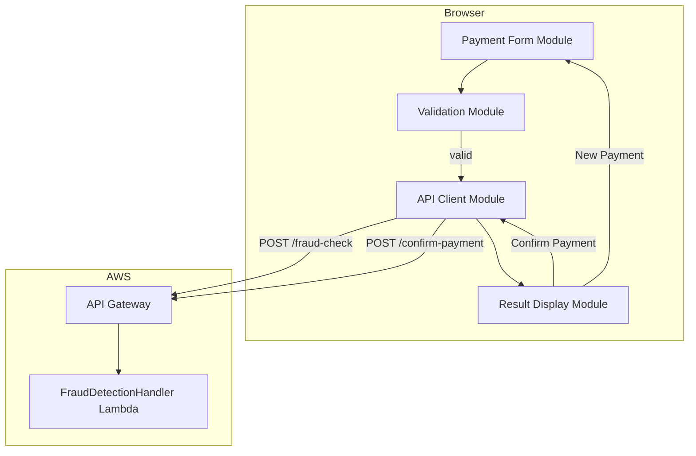
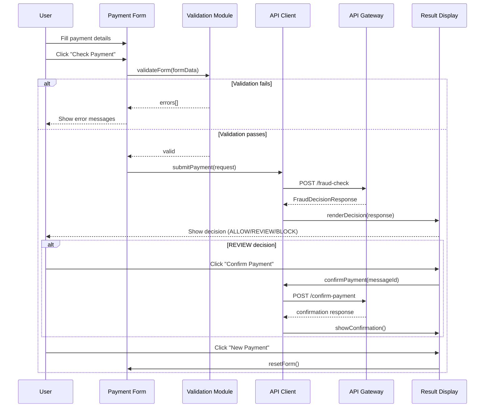

# Design Document: Payment Fraud UI

## Overview

This design describes a single-page web application that provides payment operators with a form-based interface for submitting UK Faster Payments to the existing fraud detection API. The UI handles input collection, client-side validation, API communication, and decision result display — including the confirm-payment flow for REVIEW decisions.

The frontend is a standalone HTML/CSS/JavaScript application (no build tooling required) served as static assets. It communicates with the existing API Gateway endpoint that fronts the `FraudDetectionHandler` Lambda. This keeps the UI decoupled from the backend Java codebase while reusing the full scoring and decision infrastructure already in place.

### Key Design Decisions

1. **Vanilla JavaScript SPA** — No framework dependency (React, Vue, etc.). The UI is simple enough that a single HTML page with modular JS files provides sufficient structure without adding build complexity or frontend tooling to this Gradle-based Java project.
2. **Static hosting** — The UI files live in a `frontend/` directory at the project root. They can be served locally for development or deployed to S3 + CloudFront for production.
3. **Client-side validation mirrors backend rules** — Validation logic runs in the browser before any API call, matching the `RequestValidator` constraints on the backend. This gives instant feedback and reduces unnecessary API traffic.
4. **Separation of concerns** — The UI is split into distinct modules: form management, validation, API client, and result rendering.

## Architecture



### Component Interaction Flow



## Components and Interfaces

### 1. Payment Form Module (`form.js`)

Manages the DOM form element, collects input values, and coordinates submission.

```javascript
// Public interface
const PaymentForm = {
  init(formElement, onSubmit) {},       // Bind form and submit handler
  getFormData() {},                      // Returns structured form data object
  setLoading(isLoading) {},             // Toggle loading state and button disable
  clearErrors() {},                      // Remove all validation error displays
  showErrors(errors) {},                // Display validation error messages
  reset() {},                           // Reset all fields to empty/default state
  hide() {},                            // Hide the form section
  show() {}                             // Show the form section
};
```

**FormData shape:**
```javascript
{
  debtorSortCode: string,       // "12-34-56"
  debtorAccountNumber: string,  // "12345678"
  debtorAccountName: string,    // "John Smith"
  creditorSortCode: string,
  creditorAccountNumber: string,
  creditorAccountName: string,
  amount: string,               // "1500.00"
  paymentReference: string,     // "Invoice 1234"
  channelType: string,          // "MOBILE" | "ONLINE_BANKING" | ...
  copResult: string,            // "MATCH" | "CLOSE_MATCH" | ...
  copMatchedName: string        // "Jane Doe"
}
```

### 2. Validation Module (`validation.js`)

Pure functions that validate form data and return error arrays.

```javascript
// Public interface
const Validator = {
  validate(formData) {},  // Returns { valid: boolean, errors: ValidationError[] }
};

// ValidationError shape
{ field: string, message: string }
```

**Validation Rules:**

| Field | Rule | Error Message |
|-------|------|---------------|
| debtorSortCode | Required, 6 digits (NN-NN-NN) | "Debtor sort code is required" / "Debtor sort code must be 6 digits" |
| debtorAccountNumber | Required, exactly 8 digits | "Debtor account number is required" / "Debtor account number must be 8 digits" |
| creditorSortCode | Required, 6 digits (NN-NN-NN) | "Creditor sort code is required" / "Creditor sort code must be 6 digits" |
| creditorAccountNumber | Required, exactly 8 digits | "Creditor account number is required" / "Creditor account number must be 8 digits" |
| amount | Required, numeric, 0.01–999999999.99, max 2 dp | "Amount is required" / "Amount must be a number between 0.01 and 999,999,999.99" / "Amount must have at most 2 decimal places" |
| channelType | Required selection | "Channel type is required" |

### 3. API Client Module (`api.js`)

Handles HTTP communication with the fraud detection API Gateway endpoint.

```javascript
// Public interface
const ApiClient = {
  init(baseUrl) {},                           // Set API base URL
  submitPayment(fasterPaymentRequest) {},     // POST to /fraud-check, returns Promise<FraudDecisionResponse>
  confirmPayment(messageId) {}                // POST to /confirm-payment, returns Promise<ConfirmationResponse>
};
```

**Behaviour:**
- Enforces a 10-second request timeout using `AbortController`
- Distinguishes HTTP errors (non-2xx status), timeout errors, and network errors
- Returns structured error objects so the result display can show appropriate messages

### 4. Result Display Module (`result.js`)

Renders fraud decision outcomes and manages the confirm-payment flow.

```javascript
// Public interface
const ResultDisplay = {
  init(containerElement) {},                  // Bind result container
  renderAllow(response) {},                   // Green success display
  renderReview(response, onConfirm) {},       // Amber warning + confirm button
  renderBlock(response) {},                   // Red danger display
  renderError(error) {},                      // Error message display
  showConfirmationSuccess() {},               // Post-confirm success
  showConfirmationError() {},                 // Post-confirm failure
  setConfirmLoading(isLoading) {},           // Toggle confirm button loading
  hide() {},                                  // Hide result section
  show() {}                                   // Show result section
};
```

### 5. App Controller (`app.js`)

Coordinates modules and handles the overall application flow.

```javascript
// Initialises all modules, wires event handlers
const App = {
  init(config) {}  // config: { apiBaseUrl, formElement, resultElement }
};
```

## Data Models

### Request Payload (FasterPaymentRequest)

The UI constructs a JSON payload matching the existing `FasterPaymentRequest` record:

```json
{
  "messageId": "uuid-v4",
  "debtorAccount": {
    "sortCode": "123456",
    "accountNumber": "12345678",
    "accountName": "John Smith"
  },
  "creditorAccount": {
    "sortCode": "654321",
    "accountNumber": "87654321",
    "accountName": "Jane Doe"
  },
  "amount": 1500.00,
  "currency": "GBP",
  "paymentReference": "Invoice 1234",
  "confirmationOfPayee": {
    "result": "MATCH",
    "matchedName": "Jane Doe"
  },
  "channel": {
    "type": "ONLINE_BANKING",
    "deviceId": null,
    "geoLocation": null,
    "sessionDuration": null
  },
  "timestamp": "2024-01-15T10:30:00Z"
}
```

**Notes:**
- `messageId` is generated client-side as a UUID v4
- `currency` is always "GBP" (hardcoded for UK Faster Payments)
- `timestamp` is ISO 8601 UTC at time of submission
- `channel.deviceId`, `channel.geoLocation`, and `channel.sessionDuration` are set to `null` from the UI (the backend handles these as optional fields)
- Sort codes are sent without hyphens (stripped from the display format "NN-NN-NN" to "NNNNNN")

### Response Payload (FraudDecisionResponse)

```json
{
  "messageId": "uuid-v4",
  "decision": "ALLOW" | "REVIEW" | "BLOCK",
  "riskScore": 42,
  "breakdown": {
    "amountScore": 15,
    "copScore": 0,
    "behaviouralScore": 12,
    "channelScore": 15
  },
  "riskFactors": [
    { "category": "amount", "explanation": "Amount exceeds typical pattern" }
  ],
  "timestamp": "2024-01-15T10:30:00.123Z"
}
```

### Validation Error Model (client-side)

```typescript
interface ValidationError {
  field: string;    // form field identifier
  message: string;  // human-readable error message
}

interface ValidationResult {
  valid: boolean;
  errors: ValidationError[];
}
```

### API Error Model (client-side)

```typescript
interface ApiError {
  type: "http" | "timeout" | "network";
  statusCode?: number;        // present for "http" type
  description?: string;       // error body from server, or descriptive message
}
```


## Correctness Properties

*A property is a characteristic or behavior that should hold true across all valid executions of a system — essentially, a formal statement about what the system should do. Properties serve as the bridge between human-readable specifications and machine-verifiable correctness guarantees.*

### Property 1: Sort code validation

*For any* string, the sort code validator SHALL accept it if and only if it consists of exactly 6 digit characters (optionally formatted as NN-NN-NN). All other strings SHALL be rejected with an appropriate error message.

**Validates: Requirements 2.2, 2.6**

### Property 2: Account number validation

*For any* string, the account number validator SHALL accept it if and only if it consists of exactly 8 digit characters. All other strings SHALL be rejected with an appropriate error message.

**Validates: Requirements 2.4, 2.8**

### Property 3: Amount validation

*For any* string input, the amount validator SHALL accept it if and only if it represents a valid numeric value in the range [0.01, 999999999.99] with at most 2 decimal places. All other inputs (non-numeric, out-of-range, excess decimal places, empty) SHALL be rejected with the corresponding error message.

**Validates: Requirements 2.9, 2.10, 2.11**

### Property 4: All validation errors returned simultaneously

*For any* form data containing N independently invalid fields, the validator SHALL return exactly N error messages (one per invalid field) and SHALL NOT short-circuit after the first failure.

**Validates: Requirements 2.13**

### Property 5: Request payload construction

*For any* valid form data, the constructed FasterPaymentRequest JSON payload SHALL contain a valid UUID v4 messageId, an ISO 8601 timestamp, currency "GBP", and all form field values mapped to their correct positions in the FasterPaymentRequest schema.

**Validates: Requirements 3.1**

### Property 6: Risk score rendering

*For any* FraudDecisionResponse (regardless of decision type), the rendered result display SHALL contain the numeric risk score value labeled "Risk Score".

**Validates: Requirements 4.2, 5.2, 6.2**

### Property 7: Risk breakdown rendering

*For any* FraudDecisionResponse, the rendered result display SHALL contain all four breakdown component values (amountScore, copScore, behaviouralScore, channelScore) each with their respective labels.

**Validates: Requirements 4.3, 5.3, 6.3**

### Property 8: Risk factor list rendering

*For any* FraudDecisionResponse containing one or more risk factors, the rendered result display SHALL include every risk factor's category and explanation as a visible list item.

**Validates: Requirements 5.4, 6.4**

### Property 9: Form reset clears all state

*For any* form state (with arbitrary values in text fields and selections in dropdowns), invoking the reset function SHALL result in all text inputs being empty, all dropdowns having no selection, and the submit button being enabled.

**Validates: Requirements 7.2**

## Error Handling

### Client-Side Validation Errors

- All validation errors are collected and displayed simultaneously (never short-circuit)
- Errors are displayed inline next to each field using ARIA-described-by for accessibility
- Errors are cleared when the user submits a corrected form

### API Communication Errors

| Error Type | Detection | User Message |
|---|---|---|
| HTTP Error | Response status !== 2xx | "Error {statusCode}: {description}" |
| Timeout | AbortController signal after 10s | "Request timed out. Please try again." |
| Network | `fetch` throws TypeError | "Unable to connect. Please check your connection and try again." |

### Confirm Payment Errors

- Same error types as submission (HTTP, timeout, network)
- "Confirm Payment" button is re-enabled so the user can retry
- Error message displayed below the confirm button

### Error Recovery

- All error states allow retry (submit button / confirm button re-enabled)
- "New Payment" button is always available from any error state
- No stale state is retained across retries

## Testing Strategy

### Unit Tests (Example-Based)

Unit tests cover specific scenarios, UI element presence, and integration points:

- **Form rendering**: Verify all required fields, dropdowns, and buttons are present (Requirements 1.1–1.9)
- **Decision routing**: ALLOW/REVIEW/BLOCK responses route to correct renderers (Requirement 3.3)
- **Loading state**: Submit button disabled and loading indicator shown during API call (Requirements 3.2, 3.4, 3.8)
- **Error display**: HTTP errors show status code; timeouts show retry message; network errors show connectivity message (Requirements 3.5–3.7)
- **ALLOW specifics**: "Payment Approved" text, success styling, visual distinction (Requirements 4.1, 4.4)
- **REVIEW specifics**: "Payment Held for Review" text, "Confirm Payment" button presence, confirm flow (Requirements 5.1, 5.5–5.8)
- **BLOCK specifics**: "Payment Blocked" text, no confirm button, cannot-proceed message, empty risk factors hidden (Requirements 6.1, 6.5–6.7)
- **New Payment**: Button presence after results, result display hidden on click (Requirements 7.1, 7.3)

### Property-Based Tests

Property-based tests verify universal invariants using the **jqwik** library (already in the project's test dependencies). Each property test runs a minimum of 100 iterations with randomly generated inputs.

| Property | Generator Strategy | Tag |
|---|---|---|
| Sort code validation | Random strings (0–20 chars, mix of digits/alpha/symbols) | Feature: payment-fraud-ui, Property 1: Sort code validation |
| Account number validation | Random strings (0–20 chars, mix of digits/alpha/symbols) | Feature: payment-fraud-ui, Property 2: Account number validation |
| Amount validation | Random strings (numbers, text, edge values, varying decimals) | Feature: payment-fraud-ui, Property 3: Amount validation |
| Simultaneous errors | Form data with 0–6 randomly invalidated fields | Feature: payment-fraud-ui, Property 4: All validation errors returned simultaneously |
| Request payload | Valid form data with random values within constraints | Feature: payment-fraud-ui, Property 5: Request payload construction |
| Risk score rendering | Random FraudDecisionResponse with score 0–100 | Feature: payment-fraud-ui, Property 6: Risk score rendering |
| Breakdown rendering | Random FraudDecisionResponse with 4 random component scores | Feature: payment-fraud-ui, Property 7: Risk breakdown rendering |
| Risk factor rendering | Random responses with 1–10 risk factors (random categories/explanations) | Feature: payment-fraud-ui, Property 8: Risk factor list rendering |
| Form reset | Form data pre-populated with random values | Feature: payment-fraud-ui, Property 9: Form reset clears all state |

### Test Configuration

- **Framework**: jqwik 1.8.4 (for property tests), JUnit 5 (for unit tests)
- **Minimum iterations**: 100 per property test
- **Test location**: `src/test/java/property/` for property tests, `src/test/java/unit/` for unit tests
- **Note**: Since the UI is vanilla JavaScript, property tests for validation logic can be written in Java against a shared validation module, or using a JS test runner (e.g., Vitest with fast-check). The validation logic should be implemented as pure functions that are testable independent of the DOM.

### Integration Tests

- End-to-end test with a running API (localstack or mocked API Gateway) to verify the full submit → result flow
- Confirm payment round-trip test
- Timeout behaviour test with artificially slow endpoint
